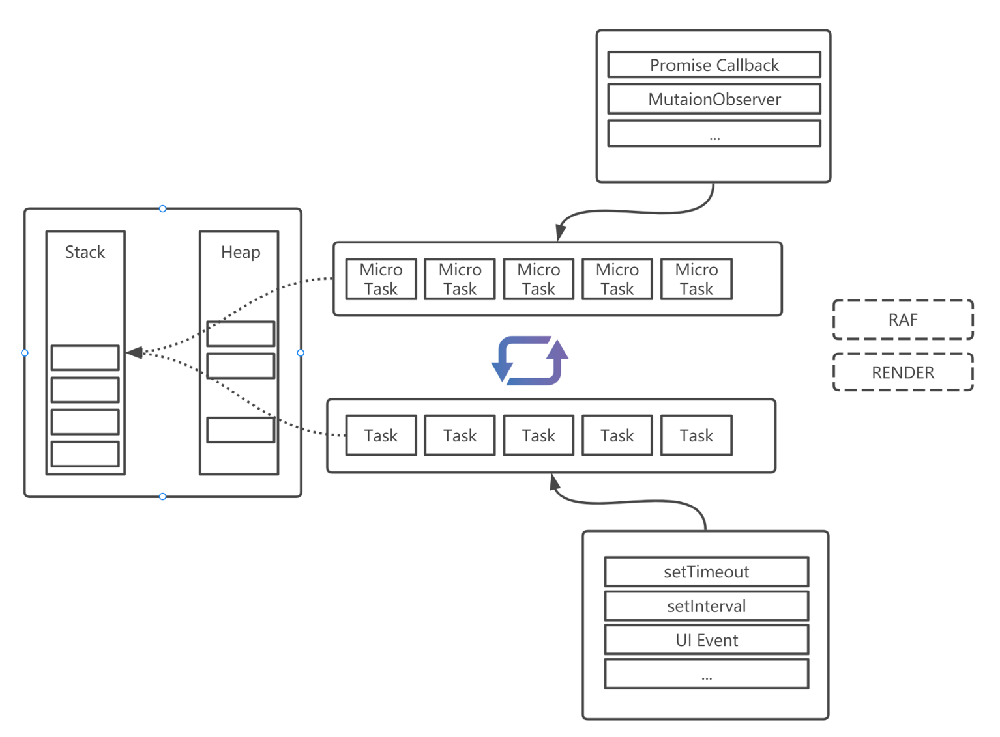

# Eventloop

## what is

- 首先, 什么是事件循环呢, 简单来说就是用来编排各种不同事件的运行机制
- 不管是在浏览器端还是nodejs中, 都有各种不同的事件: 用户交互(浏览器), 渲染(浏览器), 定时器(setTimeout, setInterval), 网络读写, 文件读写等等, 而众所周知js是单线程的编程语言, 这些任务不可能同时执行, 并且只要我们的应用处于运行中, 这些事件就会不断产生, 那就需要某种机制来让这些事件以适当的方式运行, 这便是eventloop

## js的单线程

- 我们都知道, js是一种单线程, 异步非阻塞的编程语言, 在更进一步之前, 我们需要先了解一下浏览器.
  - **单线程**描述的主要是js引擎, 浏览器实际上是多进程的, 主要包含了
    - 主进程, 负责管理其他进程, 如资源的下载, 浏览器界面的展示等
    - GPU进程, 用于3D绘制
    - 渲染进程, 也就是跟我们打交道最多的进程, 其内部是多线程的, 主要包含:
      - GUI渲染线程
      - js引擎线程, 即执行我们代码的线程
      - 事件触发线程
      - 定时器触发线程
      - http请求线程
  - 需要注意的是, GUI渲染线程和js引擎线程是互斥的, js引擎执行时, GUI线程就会被挂起
    - 通常来说, 浏览器会尝试以60hz(通常的操作系统的刷新频率, 但使用高刷新率的显示屏时浏览器是否会以同样的频率进行刷新还需要进一步验证)的频率更新页面, 即一秒钟更新60帧, 约16.6ms更新一次, 但更新时机由浏览器决定, 即更新时机并不确定
    - GUI更新会被保存在一个队列中, 在js引擎空闲时执行
    - 综上, 浏览器会尝试以60hz的频率更新页面, 而js引擎的执行可能会导致渲染被推迟, 而更长时间的阻塞甚至会导致浏览器无法按照60hz的频率刷新页面, 即产生"丢帧", 页面即会有"卡顿"的感觉
      - *这也就是性能指标RAIL中I的由来, 当js引擎idle的时间越久, 浏览器便越容易达成60hz的渲染目标, 用户看到的页面也便越流畅*
  - js引擎并不负责如`setTimeout`, `http请求`等任务的执行, 这听起来有点奇怪, 但确实是这样的, 这些任务是由浏览器/nodejs的其他进程执行的, 这样的任务我们可以统称为`Web API`
    - 当我们调用这些api时, js引擎会调用浏览器的底层接口, 并初始化一个任务, 由其他线程负责"监视", 当任务完成时, 再通知js引擎:该任务已经完成了, 可以进行下一步
      - 在nodejs中也是类似的, 但是nodejs端的js引擎不是运行于浏览器的, `Web API`调用的是操作系统的api
    - 这个"下一步", 就是我们调用api时提供的`回调函数`, 接下来, js引擎就会在适当的时机执行该`回调函数`
    - js被称为"异步非阻塞"的编程语言主要也就是这个原因, 通常像http请求这样的任务, 无法立即得到执行结果并返回给调用者, 此时如果继续停留并等待, 则后续的所有任务都需要等待(即所谓的"阻塞"), 因此js引擎将该任务交由其他线程执行后立即返回(非阻塞), 该任务不会在js引擎线程中执行(异步), 因此我们称js是异步且非阻塞的

## 微任务和宏任务

### 分类

- 现在我们已经知道了如`setTimeout`, `http请求`等实际是由浏览器的其他进程执行的, 在我们通过js代码创建这些任务时, 会提供`回调函数`, 在执行进程完成任务时, 通知js引擎继续执行回调函数, 这些`回调函数`便是eventloop要处理的对象
- 根据优先级的高低, 可以将这些任务分为两类: `Task` 和 `Micro Task`, js引擎会交替执行这两类任务
  - *`Task`也有译成`Macro Task`的, 但规范中的称呼就是`Task`, 在英文交流中需要留意, 并且`Macro`与`Micro`发音很接近, 也需要加以区分*
  - script的同步代码也属于`Task`. js引擎首先会执行完script中所有的同步代码, 然后进入事件循环.
  - 关于`Promise`需要留意的是其回调属于`Micro Task`, 但用于初始化Promise的函数(Promise Function)属于`Task`
  - 

### 执行机制

- 
- 事件循环的执行过程大体为如上图所示
  - 首先js引擎会执行js脚本, 直到调用栈清空, 此时就完成了事件循环的初始化, 进入事件循环, 如前所述, js脚本属于宏任务, 则接下来会执行微任务
  - 在事件循环中, 微任务并不是单个任务逐个执行, 而是以队列(queue)的形式存放当前待执行的所有任务, 在执行时, 先入先执行, 一次性执行完队列中所有的任务, 然后进入宏任务执行阶段, 并且在执行中如果有新增的微任务, 会持续执行直到当前队列为空
  - 而宏任务的执行则不尽相同, 取决于不同浏览器的实现, 可能是清空一个队列后转入下一队列执行, 也可能是从宏任务队列中取出一个任务, 执行完后转入微任务执行阶段
  - 事件循环即是`Web API`不断产生各种事件的回调, 又或者在执行这些回调过程中产生新的回调, 这些回调不断被放入相应的微任务或宏任务队列中, js引擎不断在微任务与宏任务队列间切换执行
- 之前提到过, js引擎线程与渲染线程是冲突的, 那渲染会在什么时间进行呢
  - 上图中虚线部分就代表了浏览器的渲染, 其中的`RAF`代表`requesAnimationFrame`. 首先如前所述, 何时进行渲染是不可预知的, 浏览器会根据需要(60hz), 在某次执行完微任务队列后, 切换至渲染线程进行渲染, 并且在切换之前, 调用`requesAnimationFrame`, 在渲染时, js引擎是是停止执行的状态, 完成渲染后, 再切换回js引擎继续事件循环, 因此虽然`requesAnimationFrame`看起来与`setTimeout`有相似的作用, 但实际上与事件循环并无关联, 而是属于渲染机制的一部分
  - 需要注意的是, 浏览器的事件循环中的每个阶段都没有`硬性限制`这样的机制存在, js引擎会持续执行队列中的任务, 直到队列和执行栈为空才会进入下一个阶段, 假如某个队列执行时间过长, 就会直接影响到接下来的任务的执行, 导致不能按预期的时间切换至渲染线程, 进而导致页面显示效果不佳, 假如陷入死循环, 则页面会直接`卡死`

### nodejs的事件循环

<!-- TODO -->

## 实例

- 事件循环的机制大体就是如上所述, 下面就通过一些实例来说明
<!-- TODO -->

### 基本的循环

- 首先看一下基本的循环, html文档: [事件循环](./browser/eventloop-browser.html)

  - 其中的js脚本会创建以下几种类型的任务

  - UI事件

  ```javascript
    document.getElementById('btn').onclick = clickHandler
    function clickHandler() {
      console.log('UI event');
      createMicroTask()
    }
  ```

  - 直接创建微任务

  ```javascript
    function createMicroTask() {
      return Promise.resolve().then(
        () => {
          console.log('micro task >>');
        }
      )
    }
  ```

  - 创建一个promise

  ```javascript
    function createPromise() {
      return new Promise(
        resolve => {
          console.log('promise func');
          resolve()
        })
        .then(_ => {
          console.log('promise callback')
        })
    }
  ```

  - 创建一个宏任务

  ```javascript
    function createMacroTask(duration) {
      setTimeout(() => {
        console.log('>macro task', new Date().valueOf());
      }, duration || 0);
    }
  ```

  - 脚本任务

  ```javascript
    console.log('script');
  ```

  - 整个脚本会执行以下代码

  ```javascript
    console.log('script');
    createMacroTask()
    createMacroTask()
    createMacroTask(3000)
    createMicroTask()
    createMicroTask()
    createPromise()
  ```

  - 最终执行后会得到以下结果:

    1.执行js脚本中的任务, 输出`script` 
    2.执行2次创建宏任务(定时器回调)的函数, 但当前还未结束宏任务执行(js脚本属于宏任务),所以不会立即输出
    3.执行一个延后的定时器,会创建一个宏任务